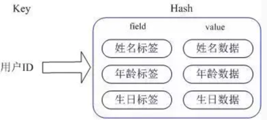

关注redis客户端
jedis
lettuce

jetcache缓存框架
https://github.com/alibaba/jetcache/wiki/Home_CN
需要集群、读写分离、异步等特性支持请使用lettuce客户端
不需要 则使用jedis

分布式锁https://zhuanlan.zhihu.com/p/135864820
Redisson是用于在 Java 程序中操作 Redis 的库,可用于分布式锁
Redis 实现分布式锁主要步骤
指定一个 key 作为锁标记，存入 Redis 中，指定一个 唯一的用户标识 作为 value。
当 key 不存在时才能设置值，确保同一时间只有一个客户端进程获得锁，满足 互斥性 特性。
设置一个过期时间，防止因系统异常导致没能删除这个 key，满足 防死锁 特性。
当处理完业务之后需要清除这个 key 来释放锁，清除 key 时需要校验 value 值，需要满足 只有加锁的人才能释放锁 。

借助 Redisson 的 WatchDog机制能够很好的解决锁续期的问题
127.0.0.1:6379> HGETALL myLock
1) "285475da-9152-4c83-822a-67ee2f116a79:52"
2) "1" 
   hash 结构的 key 是锁的名称，field 是客户端 ID，value 是该客户端加锁的次数
   
加锁机制、锁互斥机制、Watch dog 机制、可重入加锁机制、锁释放机制、等五个方面对 Redisson 实现分布式锁的底层原理进行分析。
1.加锁其实是通过一段 lua 脚本实现的
2.锁互斥 如果客户端 2 来尝试加锁，首先，第一个if判断会执行 exists myLock，发现 myLock 这个锁 key 已经存在了。接着第二个 if 判断，
判断myLock 锁 key 的 hash 数据结构中，是否包含客户端 2 的 ID，这里明显不是，因为那里包含的是客户端 1 的 ID。所以，客户端 2 会执行：
return redis.call('pttl', KEYS[1]); 返回的一个数字，这个数字代表了 myLock 这个锁 key 的剩余生存时间。
最终通过subscribeFuture订阅锁释放事件
3.锁续期机制 watch dog
客户端 1 加锁的锁 key 默认生存时间才 30 秒，如果超过了 30 秒，客户端 1 还想一直持有这把锁
Watch Dog 机制其实就是一个后台定时任务线程，获取锁成功之后，会将持有锁的线程放入到一个 RedissonLock.EXPIRATION_RENEWAL_MAP里面，然后每隔 10 秒
4.可重入加锁机制
加锁那段 lua 代码

5.释放锁机制

LRU/LFU
https://my.oschina.net/lscherish/blog/4467394

REDIS 5.0
全新数据类型streams
lolwut
lua改进
动态hz
support docker